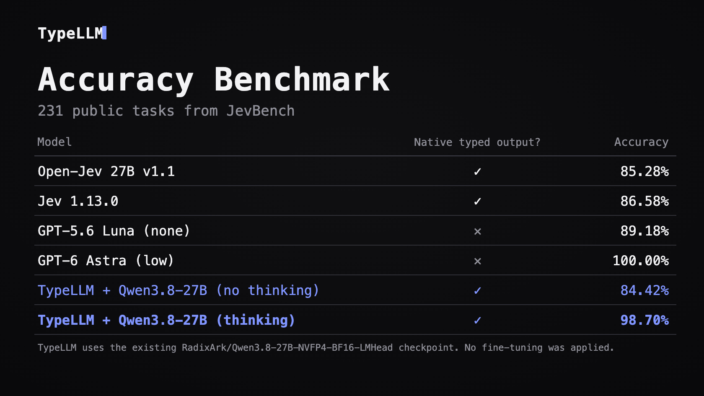

# JevBench public subset: TypeLLM

TypeLLM results on **231 public [JevBench](https://github.com/fstandhartinger/jevbench) tasks**, evaluated on 2026-09-23.

## Comparison



External results are reported by [Open-Jev](https://zefan-cai.github.io/open-jev/).
TypeLLM results are from the runs documented here; model and inference settings
differ across systems.

The table below compares the model configurations of Open-Jev 27B v1.1 and
TypeLLM. Both use Qwen3.8-27B, with different weight precision and additional
training.

| Model configuration | Open-Jev 27B v1.1 | TypeLLM (both runs) |
|---|---|---|
| Base model | Qwen3.8-27B | Qwen3.8-27B |
| Weight precision | BF16 base; FP32 LoRA and decision head | NVFP4 weights; BF16 language-model head |
| Additional training | Rank-8 LoRA + scalar decision head; base weights frozen | **None** |

Sources: [Open-Jev model card](https://huggingface.co/ZefanCai/Open-Jev-27B-v1.1).
TypeLLM uses the existing `RadixArk/Qwen3.8-27B-NVFP4-BF16-LMHead` checkpoint.

## Answers

- [All 231 paired answers](ANSWERS.md)
- Full answers and probabilities: [no thinking](no_thinking/answers.jsonl) · [thinking](thinking/answers.jsonl)
- [Paired comparison](comparison.jsonl) · [Errors and changed outcomes](mismatches.jsonl)
- Detailed metrics: [no thinking](no_thinking/summary.json) · [thinking](thinking/summary.json)

Each answer includes its reference label, probabilities, latency and token counts.

## Configuration and performance

Both runs use the same model and task order, with argmax decisions and no
permutation averaging. Thinking has **no explicit token budget**. This is one
run per setting on the public subset, not the full 534-task benchmark.

| Metric | No thinking | Thinking |
|---|---:|---:|
| P50 request seconds | 1.296 | 6.677 |
| P95 request seconds | 2.150 | 61.083 |
| Thinking tokens in scored responses | 0 | 212,255 |
| Answer tokens in scored responses | 231 | 231 |

Thinking averaged 918.9 tokens per task. Timings include client and network
overhead. See [method and configuration](METHOD.md) for model details, scoring
and calibration metrics.

## Verify

From the repository root:

```bash
python evals/jevbench/verify.py
```

Benchmark: [JevBench](https://github.com/fstandhartinger/jevbench) by Florian
Standhartinger and contributors · [License](https://github.com/fstandhartinger/jevbench/blob/f8ce71361165846101d02ebc83ad44e47ae44fc3/LICENSE)
· [Third-party notices](https://github.com/fstandhartinger/jevbench/blob/f8ce71361165846101d02ebc83ad44e47ae44fc3/THIRD-PARTY.md).
