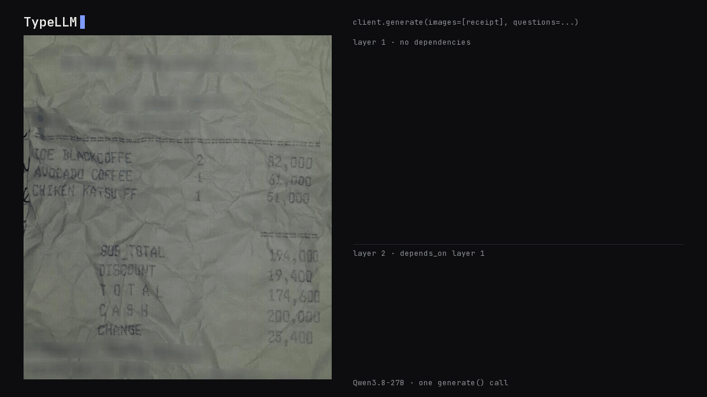

# Reading a real receipt

A photographed, crumpled restaurant receipt goes in; typed strings, integers,
numbers and booleans come out. Three fields are computed from values read
earlier, through `depends_on`.



```python
result = client.generate(
    context="Read the attached photo of a restaurant receipt.",
    images=["receipt.jpg"],
    questions={
        "first_item": {"type": "string", "maxLength": 40,
                       "instructions": "Name of the first line item, exactly as printed."},
        "item_lines": {"type": "integer", "instructions": "How many line items are listed?"},
        "subtotal": {"type": "number", "instructions": "Subtotal in rupiah as a plain number."},
        "discount": {"type": "number", "instructions": "Discount in rupiah as a plain number."},
        "paid_in_cash": {"type": "boolean", "instructions": "Was the bill paid in cash?"},
        "discount_percent": {"type": "number", "depends_on": ["subtotal", "discount"],
                             "instructions": "Discount as a percentage of the subtotal."},
        # ... see receipt.py for all 14 fields
    },
)
```

## Result

Qwen3.8-27B on one RTX PRO 6000, compared with the dataset's labels:

| Field | Type | Label | No thinking | Thinking |
| --- | --- | --- | --- | --- |
| `first_item` | string | `ICE BLACKCOFFE` | `ICE BLACKCOFFEE` ✗ | `ICE BLACKCOFFEE` ✗ |
| `second_item` | string | `AVOCADO COFFEE` | ✓ | ✓ |
| `third_item` | string | `CHIKEN KATSU FF` | ✓ | ✓ |
| `item_lines` | integer | 3 | ✓ | ✓ |
| `first_item_quantity` | integer | 2 | ✓ | ✓ |
| `subtotal` | number | 194000 | ✓ | ✓ |
| `discount` | number | 19400 | ✓ | ✓ |
| `total` | number | 174600 | ✓ | ✓ |
| `cash` | number | 200000 | ✓ | ✓ |
| `change` | number | 25400 | ✓ | ✓ |
| `paid_in_cash` | boolean | true | `false` ✗ | ✓ |
| `discount_percent` | number, from subtotal and discount | 10 | ✓ | ✓ |
| `change_is_correct` | boolean, from total, cash and change | true | ✓ | ✓ |
| **Matches** | | | **11/13 in 6.6 s** | **12/13 in 27.7 s** |

Every number is exact in both runs. The one remaining miss is the model
correcting the receipt's misspelling `BLACKCOFFE` to `BLACKCOFFEE`, despite
being asked to copy it exactly. The unlabeled `expense_note` string, generated
from four earlier fields, read:

> Purchased iced coffee, avocado coffee, and chicken katsu for a total of 174,600.

Full outputs: [result.json](result.json) (no thinking) and
[result_thinking.json](result_thinking.json).

## Run

`python examples/receipt/render_gif.py` redraws `demo.gif` from `result_thinking.json` without calling the model.

```bash
python examples/receipt/receipt.py --url http://127.0.0.1:30000
python examples/receipt/receipt.py --url http://127.0.0.1:30000 --thinking --output examples/receipt/result_thinking.json
```

## Image

Receipt 4 of the test split of [CORD v2](https://huggingface.co/datasets/naver-clova-ix/cord-v2)
(Park et al., *CORD: A Consolidated Receipt Dataset for Post-OCR Parsing*, 2019),
licensed [CC BY 4.0](https://creativecommons.org/licenses/by/4.0/). The store
details were blurred in the original dataset.
